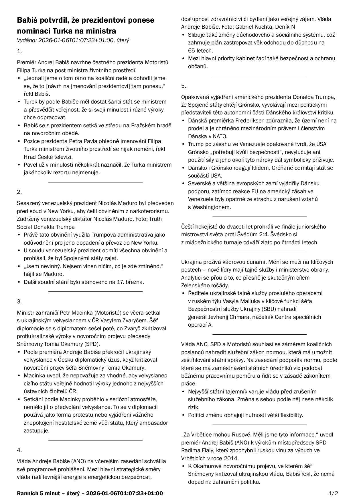
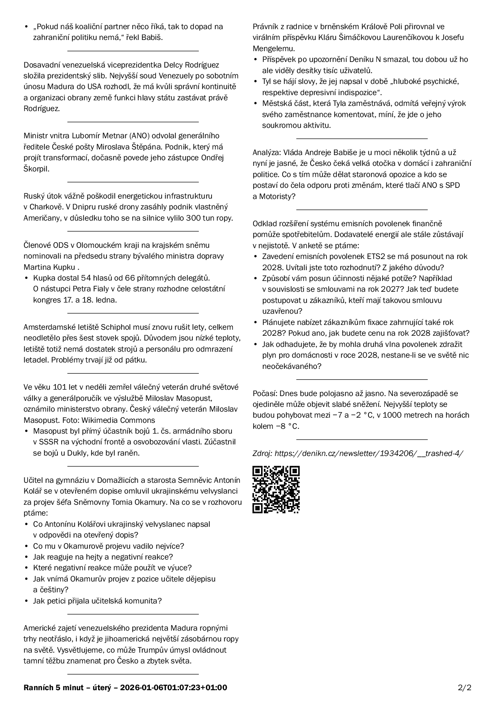

# Ranních 5 minut

Skript `main.py` stáhne dnešní vydání newsletteru Ranních 5 minut z
[denikn.cz](https://denikn.cz/newsletter/rannich-5-minut/), vygeneruje Typst
soubor, zkompiluje PDF a (pokud není použito `--dry`) pošle na na zvolenou
tiskárnu přes `lpr`.

Tento kód byl skoro stoprocentně vibekodován :)

## Proč?

Poslední dobou mě zprávy zahlcují. DenníkN mám rád a důvěřuju mu, ale nechci
sledovat nekonečný proud novinek celý den. Ráno si raději vytisknu stručné
shrnutí, v klidu ho projdu, případně si dohledám jen pár opravdu zajímavých
věcí — a pak už zprávy na zbytek dne vypnu.

## Ukázka




[PDF pro 2026-01-06](examples/rannich-5minut-2026-01-06.pdf)

## Spuštění lokálně

Volitelné přepínače:

- `-n` / `--dry` – pouze vygeneruje `.typ` a `.pdf`, netiskne
- `-P` / `--printer` – název tiskárny pro `lpr` (pokud není zadáno, použije se výchozí tiskárna)
- `-d` / `--date` – ISO datum `YYYY-MM-DD` pro stažení konkrétního vydání (výchozí je dnešní datum; musí být v RSS feedu)
- `--poll` – pokud ještě dnešní (nebo pro datum specifikované pomocí `--date`) vydání není v RSS feedu, periodicky ho kontroluje a čeká (pauza je pevně daná v kódu)

## Instalace

### Požadavky

- Python 3.12+
- Typst (`typst` v PATH)
- CUPS/`lpr` (pro tisk)
- `uv`

### Nasazení

```sh
mkdir -p ~/.local/share
git clone <repo-url> ~/.local/share/rannich-5minut
```

## Systemd user service a timer

Unit soubory patří do (XDG):

```
~/.config/systemd/user
```

V repozitáři jsou připravené šablony v `systemd/`. Nainstalujte je:

```sh
mkdir -p ~/.config/systemd/user
cp ~/.local/share/rannich-5minut/systemd/rannich-5minut.* ~/.config/systemd/user/
systemctl --user daemon-reload
systemctl --user enable --now rannich-5minut.timer
```

Timer spouští úlohu každý den v 07:02. Chcete‑li změnit čas, upravte
`OnCalendar=` v `~/.config/systemd/user/rannich-5minut.timer`.

### Volitelná konfigurace tisku

Pokud chcete jinou tiskárnu, upravte `ExecStart` v
`~/.config/systemd/user/rannich-5minut.service`, např.:

```
ExecStart=~/.local/share/rannich-5minut/main.py --printer moje_tiskarna
```

Pro test bez tisku:

```
ExecStart=~/.local/share/rannich-5minut/main.py --dry
```
